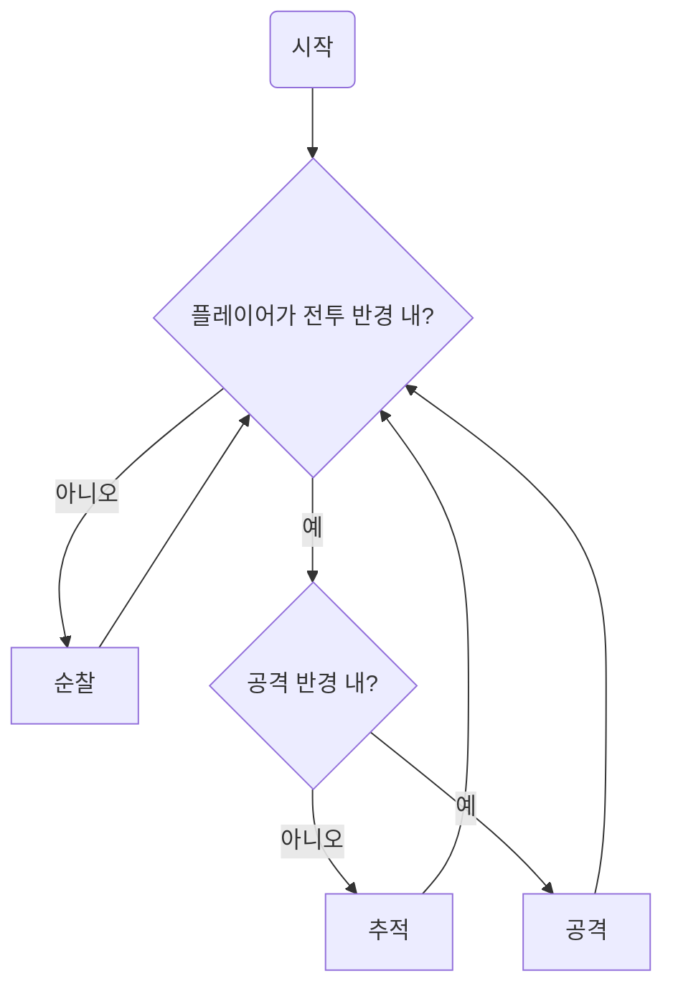
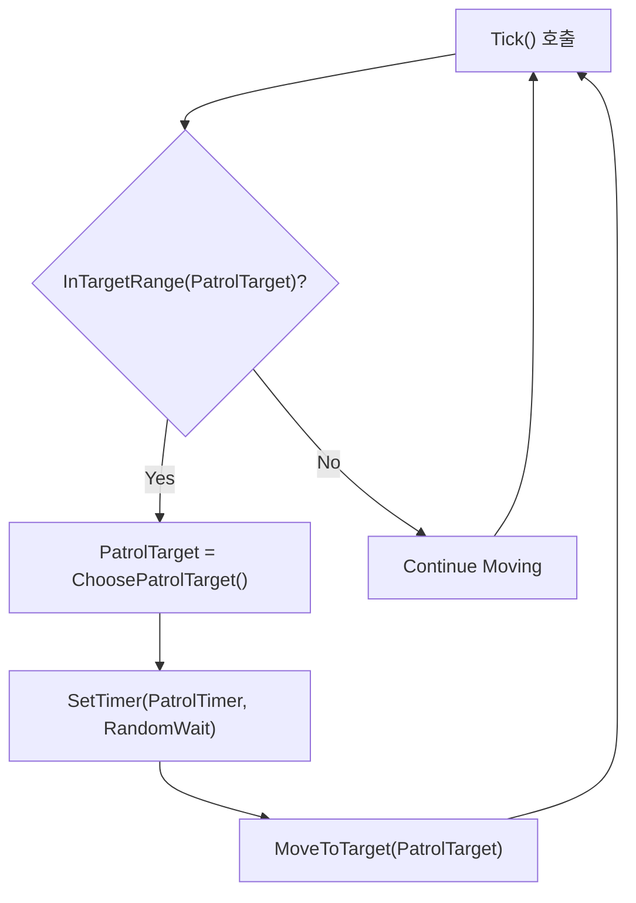
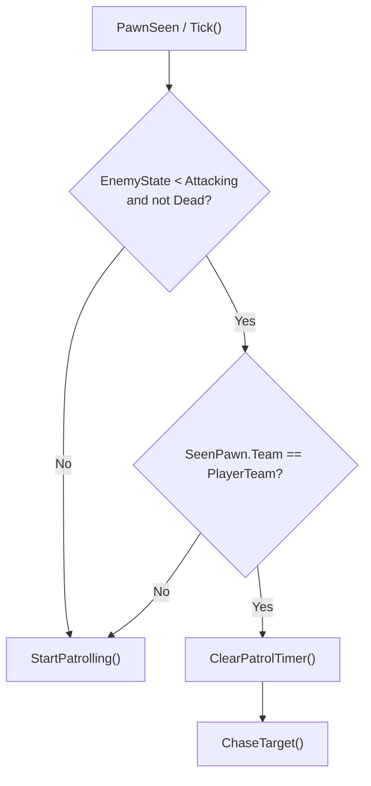
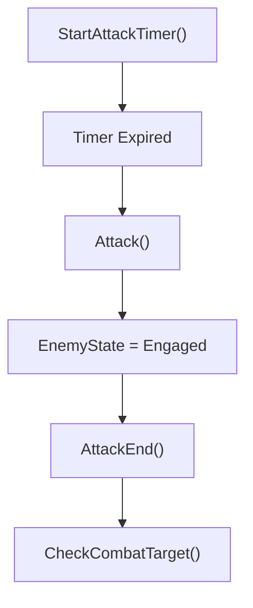

UE5 - RPG 게임 프로젝트  
제작자 : 권지현  
https://github.com/kwon1232/OpenWorldRPG

# Enemy 플레이어 공격 플로우차트

```mermaid
graph TD
    Start(시작) --> D1{플레이어가 전투 반경 내?}
    D1 -- 아니오 --> Patrol[순찰]
    D1 -- 예 --> D2{공격 반경 내?}
    Patrol --> D1
    D2 -- 아니오 --> Chase[추적]
    D2 -- 예 --> Attack[공격]
    Chase --> D1
    Attack --> D1
```

## 1. 순찰 흐름도

```mermaid
graph TD
    Start["Tick() 호출"] --> D1{"InTargetRange(PatrolTarget)?"}
    D1 -- "Yes" --> Choose["PatrolTarget = ChoosePatrolTarget()"]
    Choose --> SetTimer["SetTimer(PatrolTimer, RandomWait)"]
    SetTimer --> Move["MoveToTarget(PatrolTarget)"]
    Move --> Start
    D1 -- "No"  --> Continue["Continue Moving"]
    Continue --> Start
```

## 2. 추적 흐름도

```mermaid
graph TD
    Event["PawnSeen / Tick()"] --> C1{"EnemyState < Attacking<br/>and not Dead?"}
    C1 -- "No"  --> StartPatrol["StartPatrolling()"]
    C1 -- "Yes" --> C2{"SeenPawn.Team == PlayerTeam?"}
    C2 -- "No"  --> StartPatrol
    C2 -- "Yes" --> Clear["ClearPatrolTimer()"]
    Clear --> Chase["ChaseTarget()"]
```

## 3. 공격 흐름도

```mermaid
graph TD
    StartAtk["StartAttackTimer()"] --> TimerExpired["Timer Expired"]
    TimerExpired --> AttackCall["Attack()"]
    AttackCall --> Engaged["EnemyState = Engaged"]
    Engaged --> AttackEnd["AttackEnd()"]
    AttackEnd --> CheckCombat["CheckCombatTarget()"]
```
